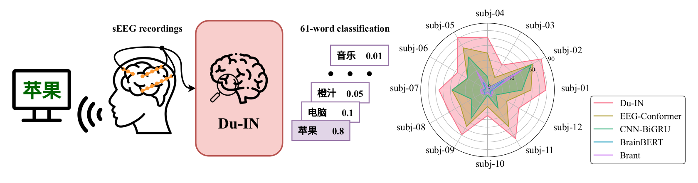
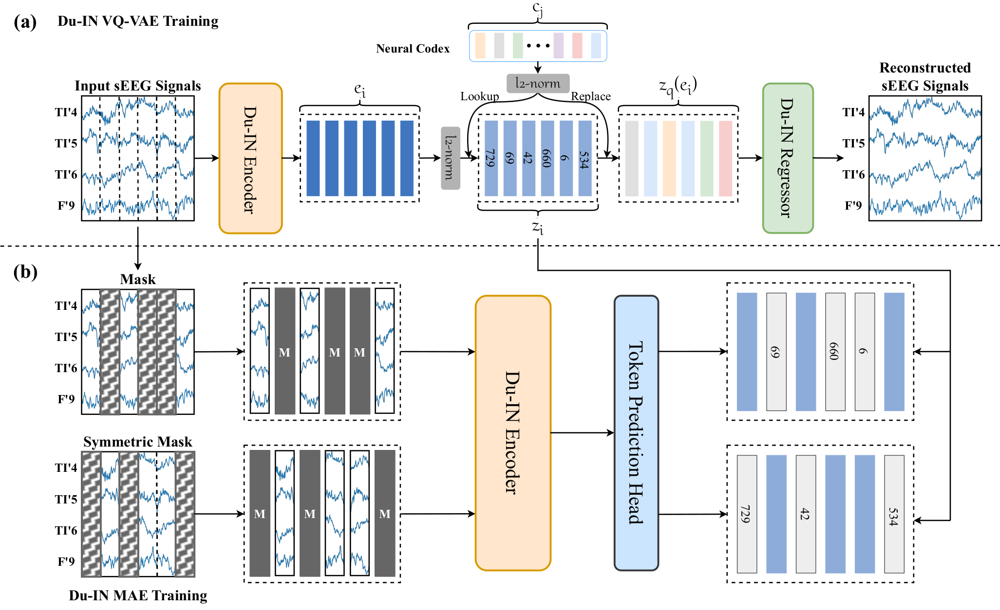
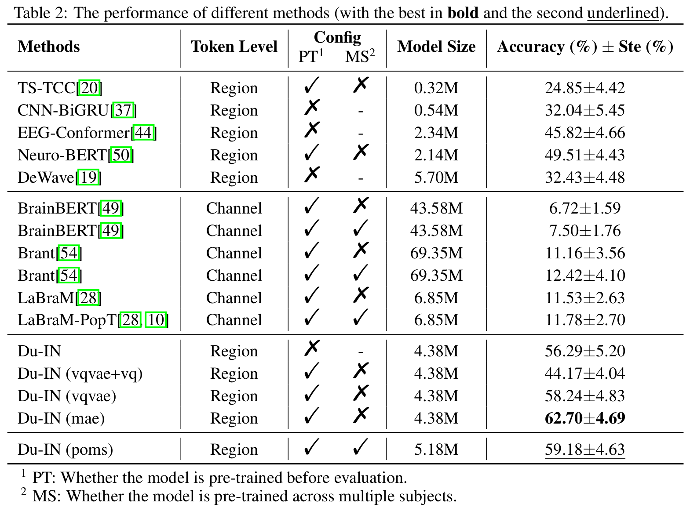

# Du-IN
This is the official implementation of our NeurIPS 2024 paper "[Du-IN: Discrete units-guided mask modeling for decoding speech from Intracranial Neural signals](https://arxiv.org/abs/2405.11459)".


## Abstract
Invasive brain-computer interfaces with Electrocorticography (ECoG) have shown promise for high-performance speech decoding in medical applications, but less damaging methods like intracranial stereo-electroencephalography (sEEG) remain underexplored. With rapid advances in representation learning, leveraging abundant recordings to enhance speech decoding is increasingly attractive. However, popular methods often pre-train temporal models based on brain-level tokens, overlooking that brain activities in different regions are highly desynchronized during tasks. Alternatively, they pre-train spatial-temporal models based on channel-level tokens but fail to evaluate them on challenging tasks like speech decoding, which requires intricate processing in specific language-related areas. To address this issue, we collected a well-annotated Chinese word-reading sEEG dataset targeting language-related brain networks from 12 subjects. Using this benchmark, we developed the Du-IN model, which extracts contextual embeddings based on region-level tokens through discrete codex-guided mask modeling. Our model achieves state-of-the-art performance on the 61-word classification task, surpassing all baselines. Model comparisons and ablation studies reveal that our design choices, including (i) temporal modeling based on region-level tokens by utilizing 1D depthwise convolution to fuse channels in the lateral sensorimotor cortex (vSMC) and superior temporal gyrus (STG) and (ii) self-supervision through discrete codex-guided mask modeling, significantly contribute to this performance. Overall, our approach -- inspired by neuroscience findings and capitalizing on region-level representations from specific brain regions -- is suitable for invasive brain modeling and represents a promising neuro-inspired AI approach in brain-computer interfaces.

## Architecture


## Main Results


## Environment Setup
Install required packages:
```
conda create env -f environment-torch.yml
conda activate brain2vec-torch
```

## Run Experiments
### Stage 0: Download sEEG dataset
The pre-training dataset (~12 hours) includes data from other cognitive tasks, but the related cognitive neuroscience papers are still under peer review.  As a result, we can only share the preprocessed version of the 61-word reading sEEG dataset (~3 hours), which is available from [here](https://huggingface.co/datasets/liulab-repository/Du-IN). Please place the downloaded `pretrains` and `data` directories in the root of the Du-IN project.

### Stage 1: Train Du-IN VQ-VAE model
The Du-IN VQ-VAE model is trained by vector-quantized neural signal prediction. It is recommended to train it on platforms with 1 * NVIDIA Tesla V100 32GB or better GPUs.
```
cd ./train/duin && python run_vqvae.py --seed 42 --subjs 001
```

### Stage 2: Train Du-IN MAE model
The Du-IN MAE model is trained by predicting the indices of codes from the neural codex in the Du-IN VQ-VAE model.
```
cd ./train/duin && python run_mae.py --seed 42 --subjs 001\
    --vqkd_ckpt ./pretrains/duin/001/vqvae/model/checkpoint-399.pth
```

### Stage 3: Train Du-IN CLS model
Run the following commands, you can change the subject id to evaluate Du-IN on different subjects:
```
cd ./train/duin && python run_cls.py --seeds 42 --subjs 001 --subj_idxs 0\
    --pt_ckpt ./pretrains/duin/001/mae/model/checkpoint-399.pth
```

## Citation
If you find our paper/code useful, please consider citing our work:
```
@article{zheng2024discrete,
  title={Du-IN: Discrete units-guided mask modeling for decoding speech from Intracranial Neural signals},
  author={Zheng, Hui and Wang, Hai-Teng and Jiang, Wei-Bang and Chen, Zhong-Tao and He, Li and Lin, Pei-Yang and Wei, Peng-Hu and Zhao, Guo-Guang and Liu, Yun-Zhe},
  journal={arXiv preprint arXiv:2405.11459},
  year={2024}
}
```

